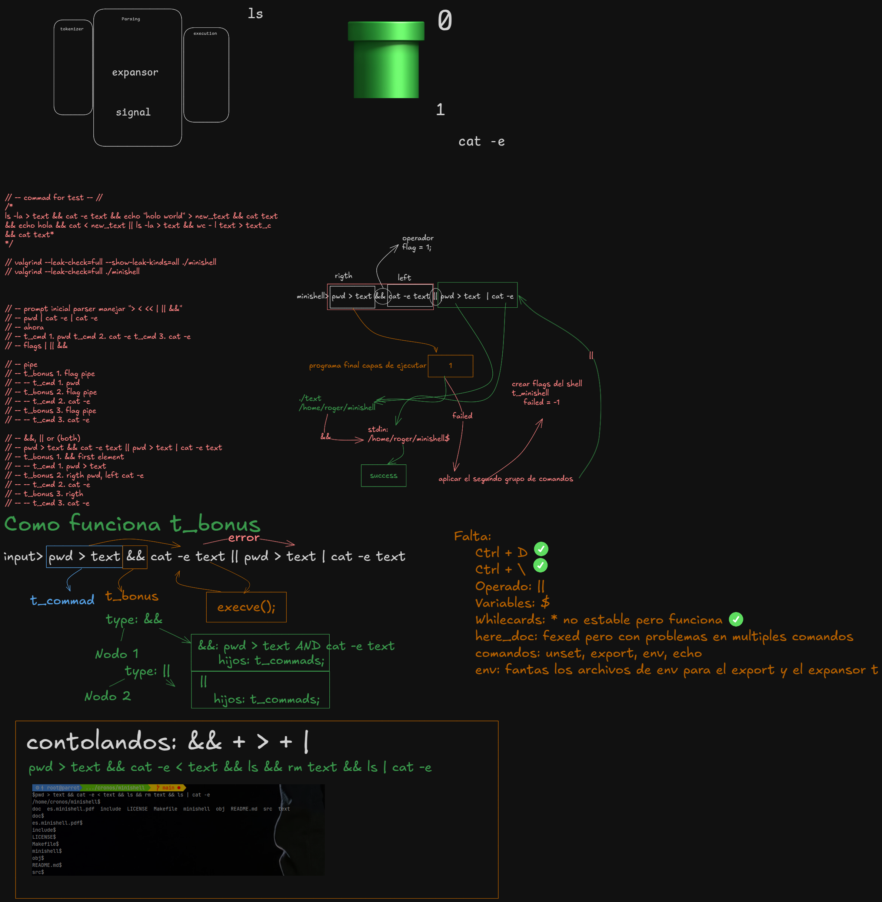

# 🛠 Planificación del Proyecto Minishell




# Cosas para corregir en el parser (incluyendo bonus)

1. `>&&`  
   **Explicación**: No puede haber un operador lógico `&&` o `||` sin que haya un comando válido antes o después de él.

2. `>|`  
   **Explicación**: El operador de redirección `>|` debe estar seguido de un archivo válido y no debe ser seguido por otros operadores como pipes (`|`).

3. `'` o `"` sueltas sin par adecuado  
   **Explicación**: Las comillas simples `'` o dobles `"` deben estar emparejadas correctamente. Las comillas sueltas son un error de sintaxis.

4. `> |cat`  
   **Explicación**: Una redirección `>` o `>>` seguida de un pipe (`|`) no tiene sentido. Debe ser seguida por un archivo válido o un comando.

5. `>` o `>>` mal formados  
   **Explicación**: Las redirecciones deben ser seguidas de un archivo o un comando válido. No se deben permitir secuencias como `>|` o `>>|`.

6. Comandos vacíos después de operadores  
   **Explicación**: Si un operador como `&&`, `||`, `>`, o `>>` es seguido por un comando vacío o incorrecto, debe marcarse como error.

7. Operadores al principio o al final de la línea  
   **Explicación**: Los operadores `&&`, `||`, `>`, `>>`, y `|` no pueden estar al principio o al final de la cadena sin un comando adecuado.

8. Espacios innecesarios entre operadores y comandos  
   **Explicación**: Se deben eliminar los espacios innecesarios alrededor de los operadores. Por ejemplo, `> file` debería ser interpretado correctamente.

9. Verificación de archivos en redirección  
   **Explicación**: Al usar redirección con `>` o `>>`, debes verificar que el archivo sea accesible y válido. No debe ser un directorio o un archivo no permitido.

10. Múltiples pipes o redirecciones sin comandos entre ellos  
    **Explicación**: No se deben permitir múltiples operadores como `|` o `>>` sin un comando o archivo válido entre ellos. Ejemplo de error: `| |`, `>> |`, `> |`.

11. Redirección de error sin redirección estándar  
    **Explicación**: Cuando se usa redirección de error (`2>`), debe haber una redirección estándar (`>`) o un archivo de destino adecuado.

12. Comillas dentro de comillas mal interpretadas  
    **Explicación**: Si se usan comillas dentro de comillas (por ejemplo, `'"'`), asegúrate de que el parser las interprete correctamente y no las vea como delimitadores erróneos.

13. Verificación de comandos válidos antes de pipes  
    **Explicación**: Asegúrate de que siempre haya un comando válido antes de un pipe (`|`). No puede haber un pipe al principio de la cadena ni después de un operador sin un comando válido.

14. `&&` y `||` con ejecución condicional  
    **Explicación**: El operador `&&` debe ejecutar el siguiente comando solo si el anterior tiene éxito, y `||` debe ejecutarse si el anterior falla. Asegúrate de que los comandos alrededor de estos operadores sean válidos.

15. Ejecución en segundo plano con `&`  
    **Explicación**: El operador `&` al final de un comando debe hacer que el comando se ejecute en segundo plano. Si el `&` está solo o seguido de espacios, debe marcarse como error.

16. Secuencia de ejecución de operadores `&&` y `||`  
    **Explicación**: Si hay una secuencia de operadores como `comando1 && comando2 || comando3`, asegúrate de que la ejecución de los comandos siga el orden correcto (ejecutar primero `&&`, luego `||`).

17. Variables de entorno (export)  
    **Explicación**: Asegúrate de que las variables de entorno sean correctamente asignadas y exportadas con el formato adecuado (`export VAR=value`).

18. Ejecución de comandos internos (builtins)  
    **Explicación**: Los comandos internos como `cd`, `exit`, `echo`, `pwd`, etc., deben ejecutarse internamente sin buscar un ejecutable en el PATH.

## 🔧 Organización del Proyecto

### 📂 Estructura de Archivos

```
📁 minishell/
│── 📄 Makefile
│── 📄 minishell.c        // Función principal
│── 📄 lexer.c            // Tokenización
│── 📄 parser.c           // Construcción de estructuras de comandos
│── 📄 executor.c         // Ejecución de comandos
│── 📄 builtins.c         // Implementación de comandos internos
│── 📄 signals.c          // Manejo de señales
│── 📄 env.c              // Manejo de variables de entorno
│── 📄 redirections.c     // Manejo de <, >, <<, >>
│── 📄 pipes.c            // Manejo de pipes (|)
│── 📄 heredoc.c          // Manejo del heredoc
│── 📄 wildcards.c        // Implementación del wildcard *
│── 📄 logical_operators.c // Implementación de && y ||
│── 📄 utils.c            // Funciones auxiliares
│── 📁 include/
│   └📄 minishell.h      // Header principal
│── 📁 libft/             // Librería auxiliar
```

### 🔀 Ramas de Git

- `main` → Rama principal estable.
- `dev` → Rama de desarrollo.
- `feature/lexer`, `feature/parser`, `feature/executor`, etc. → Desarrollo de features.
- `bonus/logical_operators` → Implementación de `&&` y `||`.
- `bonus/wildcards` → Implementación del `*`.

## 🚀 Desarrollo Paso a Paso

### 🛠 Paso 1: Configuración Inicial

**Responsable:** Roger: funcionando

- Crear el repositorio y configurar el `Makefile`.

### 📄 Paso 2: Lexer (Tokenización)

**Responsable:** Roger: completado

- Separar la entrada en tokens (`echo`, `ls`, `<`, `>`, `|`, etc.).

### 📝 Paso 3: Parser (Estructura de Comandos)

**Responsable:** Xenia y Roger: parseado completado

- Construir estructuras para comandos y operadores (`&&`, `||`).

### 🚀 Paso 4: Ejecutor (Execution) constrola && falta ||

**Responsable:** Roger

- Implementar `execve` para ejecutar comandos.

### ⚙️ Paso 5: Built-ins

**Responsable:** Roger: cd ✅ pwd ✅ exit ✅ clear ✅

- Implementar `echo`, `cd`, `pwd`, `export`, `unset`, `env`, `exit`.

### ⚡ Paso 6: Manejo de Señales

**Responsable:** Roger: ctrl+c controlado

- Implementar `CTRL+C`, `CTRL+D`, `CTRL+\`.

### 📌 Paso 7: Redirecciones y Pipes

**Responsable:** Roger: > < | controlado falta here_doc

- Implementar `<`, `>`, `>>`, `|`.

### 📚 Paso 8: Heredoc

**Responsable:** Roger en curso

- Implementar `<<` para recibir delimitadores.

### 🌐 Paso 9: Variables de Entorno

**Responsable:** Xenia

- Implementar `$VAR` y `$?`.

## 🔹 Bonus

### ✅ Bonus 1: Operadores Lógicos (`&&` y `||`)

**Responsable:** Roger: && funciona falta ||

- Implementar `&&` y `||` para ejecución condicional.

### ✅ Bonus 2: Wildcards (`*`)

**Responsable:** Xenia

- Implementar `*` para expansion de archivos.

## ⏳ Ramas y Momentos de Merge

| Fase                   | Ramas que se mergean           |      |                                   |
| ---------------------- | ------------------------------ | ---- | --------------------------------- |
| Lexer                  | `feature/lexer` → `dev`        |      |                                   |
| Parser                 | `feature/parser` → `dev`       |      |                                   |
| Executor               | `feature/executor` → `dev`     |      |                                   |
| Built-ins              | `feature/builtins` → `dev`     |      |                                   |
| Señales                | `feature/signals` → `dev`      |      |                                   |
| Redirecciones          | `feature/redirections` → `dev` |      |                                   |
| Pipes                  | `feature/pipes` → `dev`        |      |                                   |
| Heredoc                | `feature/heredoc` → `dev`      |      |                                   |
| Variables de entorno   | `feature/env` → `dev`          |      |                                   |
| **Integración final**  | `dev` → `main`                 |      |                                   |
| \*\*Bonus 1: && y      |                                | \*\* | `bonus/logical_operators` → `dev` |
| **Bonus 2: Wildcards** | `bonus/wildcards` → `dev`      |      |                                   |

## 🔥 Buenas Prácticas

- Hacer commits pequeños y descriptivos.
- Usar nombres de ramas claros (`feature/parser`, `fix/memory-leak`).
- Revisar código de los compañeros antes de hacer merge.
- Mantener `main` siempre estable.